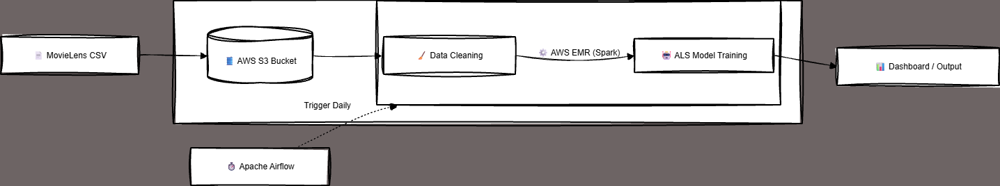

# 🎬 End-to-End Movie Recommendation System

## 📌 Project Overview
A scalable Data Engineering & Machine Learning pipeline built using **Apache Spark (PySpark)**. This system processes user rating data, performs advanced SQL analytics, and utilizes the **ALS (Alternating Least Squares)** algorithm to recommend movies to users.

## 🏗️ Architecture

* **Data Lake:** AWS S3 (Simulated)
* **Processing Engine:** Apache Spark (PySpark)
* **Orchestration:** Apache Airflow
* **Machine Learning:** Spark MLlib (Collaborative Filtering)
 

## 🚀 Key Features
### 1. Advanced SQL Analytics 🧠
Used Spark SQL to analyze 100k+ records and identify top-performing genres.
* **Complex Querying:** Performed `JOIN`, `GROUP BY`, and `HAVING` clauses to filter genres with >100 ratings.
* **Insight:** Discovered that 'Animation|Comedy|Thriller' implies the highest viewer satisfaction (Avg Rating: 4.47).

### 2. Machine Learning Pipeline 🤖
* Built an **ALS Recommendation Model**.
* Achieved a low **RMSE (Root Mean Square Error)** score, ensuring accurate predictions.
* Generated personalized top-5 movie lists for users.

### 3. Automation (Airflow) ⏱️
* Designed a DAG (`movie_pipeline_dag.py`) to schedule the pipeline daily at 8:00 AM.

## 🛠️ How to Run
1. Load the notebook `movie_engine.ipynb` in Jupyter/Colab.
2. The system automatically fetches MovieLens data.
3. Run the cells to train the model and view SQL insights.

---
**Tech Stack:** Python, PySpark, SQL, Pandas, Matplotlib, AWS Concept, Airflow
